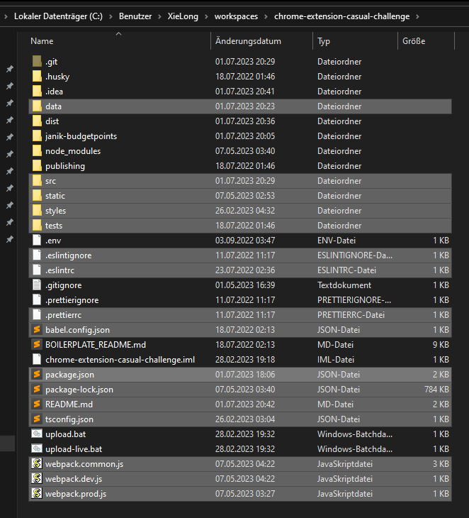

# Scryfall - Casual Challenge Checker

Checks cards and lists on scryfall.com if they are legal for the 'Casual Challenge' a custom MtG format created by Raoul Zander and Janik Nissen.

## Features

- Shows legality (banned and optionally extended) for the Casual Challenge format
- Shows Budget Points and percentage of Budget Share
- Supported views
  - Single card view
  - Deck view (list, visual, edit mode)
  - Search view (images and full mode)

## Development

### Used development stack

* Windows 10 (22H2)
* Node.js v18.15.0
* npm 9.6.4

### Build Chrome Extension

* `npm install`
* `npm run build-chrome`
* `upload[-environment].bat`
* Visit https://chrome.google.com/webstore/devconsole/96b3f2ff-adde-4b86-a5ca-dd664792f43f/cbdgdonajjfilioojjocdijiadbijpfg/edit
* Click "Prüfen lassen"

### Build Firefox Add-On

* `npm install`
* `npm run build-firefox`
* `npm run package-firefox`
* --> `dist/firefox` contains a zip file ready to be uploaded to addons.mozilla.org
* Visit https://addons.mozilla.org/en-US/developers/addon/scryfall-casual-challenge/versions/submit/
* Upload the zip file
* Firefox wants to have the source files
  * 

## Credits

Icon: [Donkey icon](https://game-icons.net/1x1/skoll/donkey.html) by [Skoll](https://game-icons.net/)
under [CC BY 3.0](http://creativecommons.org/licenses/by/3.0/)  
Recolored in #F5C823

### Disclaimer

Portions of "Scryfall - Casual Challenge Checker" are unofficial Fan Content permitted under the Wizards of the Coast
Fan Content Policy. The information presented on this extension about Magic: The Gathering, both literal and graphical,
is copyrighted by Wizards of the Coast.
This extension is not produced, endorsed, supported, or affiliated with Wizards of the Coast.
